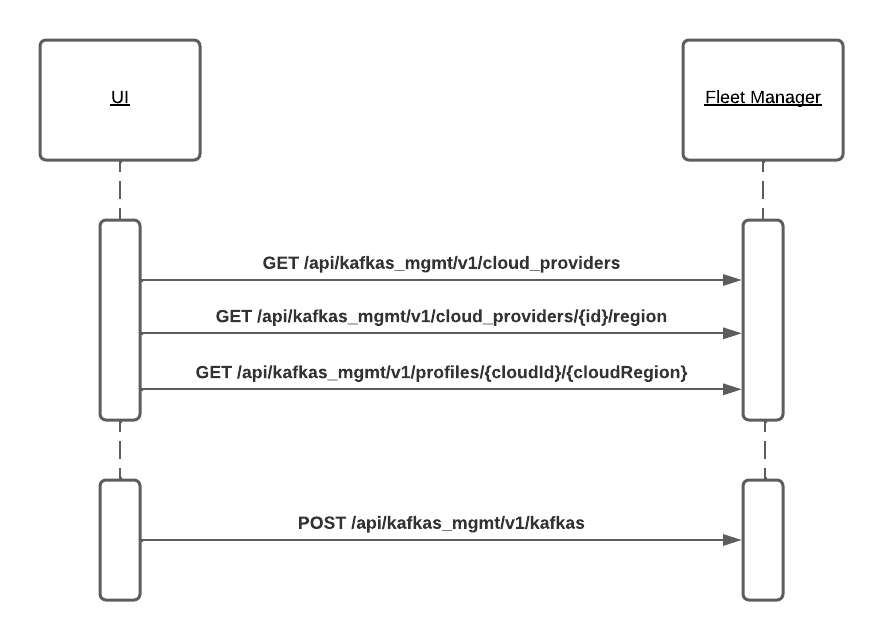
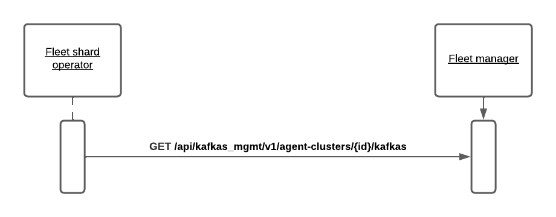

NOTE: https://datatracker.ietf.org/doc/html/rfc2119[RFC-2119] keywords are used in this proposal.

// Top style tips:
// * Use one sentence per line
// * No unexpanded acronyms
// * No undefined jargon

// No need for a title heading, it's added by the template

== Context and Problem Statement
// What is the background against which this decision is being taken?

Excluding storage sizing, the Kafka service currently supports a single size of Kafka cluster composed of 3 broker pods with fixed CPU, memory and density. 
In order for the service to be more broadly applicable to production Kafka use cases we need to be able to provide it at a variety of scales.
This means that when a user creates a Kafka instance they get to specify "how big" the instance they're creating should be. 

== Goals
// Bulleted list of outcomes that this ADR, if accepted, should help achieve

* Define how instance scaling is modelled conceptually and in the interfaces between the UI, fleet manager and fleet shard.
* Avoid tying our hands to any particular unit of scaling.
* Enable other profiles of the service in the future, without having to change the contracts between components.

== Non-goals
// Bulleted list of outcomes that this ADR is not trying to achieve.

* Consistency of scaling across different infrastructures (both on the same cloud, and between different clouds).
* Define how the fleet manager manages shard capacity.
* Storage scaling, which already supported in the fleet manager and shard, and is orthogonal to the scaling of clusters under consideration here.

== Current situation
// Where are we now?

The service does not offer any scaling options, except for storage, which is orthogonal to this problem.

== Proposal
// What is the decision being proposed

=== Conceptual model
Conceptually we define an _instance type_ (also known as a _profile_), which is an ordered list of _sizes_ of instance. 

In addition to being a composite of sizes, an _instance type_ has an id and a set of parameters that is common across all the sizes in the instance type.

A _size_ has an id (which is unique among the other sizes in the same instance type), and a set of parameter values.
Each parameter value associates a value with one of the parameters defined in the parent instance type.
Each of the sizes in an instance type MUST have the same set of function parameters (e.g. ingress bandwidth), but the values MAY differ.

Finally, we use the term _plan_ to refer to an (instance type, size)-pair.
Thus a plan is, unambiguously, a particular size of a particular instance type. 

The ordering of the list MUST be defined by the ordering of the functional attributes that define the service. 

For example, for the "Standard" instance type, we might have the sizes:

`small`:: Ingress 30MB/s, egress 30MB/s, 1000 partitions, 500 connections per instance, max 100 connections per second, 1MB max message size.
`medium`:: Ingress 60MB/s, egress 60MB/s, 2000 partitions, 1000 connections per instance, max 100 connections per second, 1MB max message size.
`large`:: Ingress 90MB/s, egress 90MB/s, 3000 partitions, 1500 connections per instance, max 100 connections per second, 1MB max message size.

In this example, the functional attributes scale linearly, with the exception of connection rate and max message size.
In general, linearity SHALL NOT be a requirement, even for those attributes which do scale up.
For example, it would have been acceptable to define the `large` ingress as 100M/s, even though this is not 3× the `small` ingress, even when the other `large` functional parameters are 3× their `small` values.

=== General principles

* An individual fleet shard is required to provide only a subset of all instance types supported by the service globally. 
Indeed, a fleet shard might possibly support only a single instance type.
For example a shard on AWS might support a different set of instance types to a shard on Azure, or the same instance types might have different sizes on those clouds.
One of the purposes of introducing the instance type and size concepts is to provide flexibility in the kinds of service offered in the future.

* The availability of an instance type might be limited to a particular cloud, region or combination of both.

* It is a private concern of the shard exactly how each size in an instance type is provisioned.
In principle it could use vertical and/or horizontal scaling and/or density > 1, in addition to applying quotas to limit capacity to the advertised limits.
The fleet manager doesn't know.

=== UI/Fleet manager interface

This ADR does not mandate any particular presentation for how the scale options are presented in the UI.
In particular while there is only one instance type defined, there is no requirement to display instance types in the UI at all.

The fleet manager SHALL be the source of truth for the instance types and sizes available, and how those depend on cloud and region. 
The fleet manager SHALL provide an endpoint which the UI MUST use to determine the available instance types and sizes.
The UI MUST NOT make assumptions about linearity of scaling, instead it uses only the instance types and sizes provided by the endpoint.

==== Instance type discovery

Reusing the "Standard" instance type defined above, let's illustrate how the Fleet Manager could communicate the available kinds of cluster to a UI.

.Sequence diagram of UI/Fleet manager interaction

After the UI has discovered the available cloud providers and regions it would make another GET request `/api/kafkas_mgmt/v1/instance_types/{cloudId}/{cloudRegion}` to discover the instance types available in this cloud and region.
An example response JSON is shown below.

[source,json]
.Example instance type available to a UI from the Fleet Manager's `GET /api/kafkas_mgmt/v1/instance_types/{cloudId}/{cloudRegion}` endpoint
----
"instance_types": [ <1>
    { "id": "standard", <2>
      "parameters": { <3>
        "ingressThroughputPerSec" : { "name": "Ingress", "unit": "MiB/s" },
        "egressThroughputPerSec": { "name": "Egress", "unit": "MiB/s" },
        "maxPartitions": { "name": "Partitions" },
        "totalMaxConnections": { "name": "Connections" },
        "maxConnectionAttemptsPerSec": { "name": "Connection Rate", "unit": "/s" },
        "maxMessageSize": { "name": "Maximum message size", "unit": "MiB" },
        "quotaType": { "name": "The kind of quota an instance of this plan consumes" }, <4>
        "quotaConsumed": { "name": "The amount of quota instance of this plan consumes" }, <5>
        "capacityConsumed": { "name": "An amount of shard capacity consumed by an instance of this plan" } <6>
      },
      "sizes": [ <7>
        { "id": "s", <8>
          "parameterValues": { <9>
            "ingressThroughputPerSec": "30", "egressThroughputPerSec": "30", 
            "maxPartitions": "1000", "totalMaxConnections": "500",
            "maxConnectionAttemptsPerSec": "100", "maxMessageSize": "1",
            "quotaType": "foo", 
            "quotaConsumed": 1, 
            "capacityConsumed": 1
          }
        },
        { "id": "m",
          "parameterValues": {
            "ingressThroughputPerSec": "60", "egressThroughputPerSec": "60", 
            "maxPartitions": "2000", "totalMaxConnections": "1000",
            "maxConnectionAttemptsPerSec": "100", "maxMessageSize": "1",
            "quotaType": "foo", 
            "quotaConsumed": 2,
            "capacityConsumed": 2
          }
        },
        { "id": "l",
          "parameterValues": {
            "ingressTh <10>roughputPerSec": "90", "egressThroughputPerSec": "90", 
            "maxPartitions": "3000", "totalMaxConnections": "1500",
            "maxConnectionAttemptsPerSec": "100", "maxMessageSize": "1",
            "quotaType": "foo", 
            "quotaConsumed": 3,
            "capacityConsumed": 3
          }
        }
      ],
    },
    { "id": "eval", 
      // ...
    }
    // other profiles as necessary
]
----
<1> The order of this list MAY be reflect the way that instance types are shown in the UI. 
E.g. "Developer", "Standard" and "Enterprise" instance types might be shown in that order.
<2> Each instance type's `id` uniquely identifies the instance type. 
It MUST NOT change.
It should be treated as an internal id and MUST NOT be exposed directly to a user.
<3> Each instance type defines a set of parameters, together with their units and descriptions. 
Each size in the instance type must give values for all the parameters that the instance type defines. 
Different instance types MAY define different parameters. 
The units and descriptions MAY be localized.
<4> A reference to a kind of quota.
This is an abstraction for how the service is billed.
Note that all plans support this parameter.
<5> A reference to an amount of quota consumed.
This is an abstraction for how the service is billed. 
Note that all plans support this parameter.
<6> This is currently needed so that the UI can report whether an instance can be created.
This parameter will be removed once a shard is able to report its capacity to the fleet manager, and the fleet manager exposes a dedicated endpoint for plan validation.
Note that all plans support this parameter.
<7> The size list MUST be ordered such that later items represent clusters with more capacity.
<8> The size `id` uniquely identifies the size within the instance type. 
It MUST NOT change.
It should be treated as an internal id and MUST NOT be exposed directly to a user.
The unit or meaning of cost is not defined in this ADR. 
<9> The `parameterValues` of a size MUST define the same properties as the instance type's `parameters` object.

NOTE: The above is not intended as a detailed API specification, merely an illustration of how the instance types and their sizes are communicated from the Fleet Manager to a UI.

Because the instance type and size ids never change a UI MAY use them as keys for localized user-facing names and descriptions.

Where it is necessary to refer to a plan using a single string, the syntax `<InstanceTypeId>.<SizeId>` SHOULD be used. 
To avoid ambiguity instance type and size ids MUST be a value RFC 1123 Label Name.

It may be necessary, eventually, to distinguish the supported actions that are supported for a given instance type and size.
For example, we might want to prevent the creation of new instances of the "eval" instance type while supporting existing instances. 
So we might eventually want additional properties in the instance size schema.

==== Instance creation

The `POST /api/kafkas_mgmt/v1/kafkas` endpoint would change to take the instance type id and size id in addition to the existing parameters.

[source,json]
.Example `POST /api/kafkas_mgmt/v1/kafkas` made by a UI to the Fleet Manager to create an instance
----
{
    "region": "us-east-1",
    "cloud_provider": "aws",
    "plan": "standard.s", <1>
    "name": "serviceapitest"

}
----
<1> New property.

To allow the API to evolve compatibly, the manager MAY use a default instance type and size in the case that the `POST` request omits these properties.

If the requested instance type and/or size is not available in that cloud provider and region a HTTP 400 error response is returned.

==== Getting instance state

Similarly, the `GET /api/kafkas_mgmt/v1/kafkas/{id}` endpoint would change to include the instance type and size.

=== Fleet manager responsibilities

The supported instance types are passed to the fleet manager via app interface.

When terraforming a shard, the manager needs to keep track of which instance types are/will be supported on that shard.

Currently it is acceptable for the manager to embed knowledge of the machine types needed by the shard.
The manager does not know how the nodes running on those machines will be used.
It is expected that a future ADR will describe a mechanism for the shard and manager to dynamically adjust the number of nodes.

=== Fleet manager/fleet shard interface

.Sequence diagram of Fleet shard operator/Fleet manager interaction

When the manager includes an instance in the response to its `GET /api/kafkas_mgmt/v1/agent-clusters/{id}/kafkas` it does not include the instance type or size.
It instead passes the functional parameters corresponding to the size selected by the user via the Managed Custom Resource.
This is basically the same as the existing contract.

[source,json]
.Example fragment of JSON for an instance included in the `GET /api/kafkas_mgmt/v1/agent-clusters/{id}/kafkas` response from the Fleet Manager
----
"capacity": { <1>
  "ingressThroughputPerSec": "4Mi", <2>
  "egressThroughputPerSec": "4Mi",
  "totalMaxConnections": "500",
  "maxDataRetentionSize": "100Gi",
  "maxPartitions": "100",
  "maxDataRetentionPeriod": "P14D",
  "maxConnectionAttemptsPerSec": "100"
}
----
<1> While these parameters are related to the size parameters exposed by the fleet manager to the UI there is no requirement for them to be the same set, or for the same ids to be used. 
<2> Currently the API uses a combined `ingressEgressThroughputPerSec` property

The shard then uses its internal model to determine the deployment configuration (in terms of `Kafka` CRs, ingress replicas and so on).
Initially this could be as simple as dividing the `ingressThroughputPerSec` by some constant in order to determine a number of brokers to be deployed, and using the remaining parameters to configure quotas.

=== Threat model
// Provide a link to the relevant threat model. 
// You must either update an existing threat model(s) to cover the changes made by this ADR, or add a new threat model.

No changes to existing threat models identified.

== Alternatives Considered / Rejected

A single instance type::
This would work fine initially, but:

* We couldn't easily offer a size smaller than "small".

* It would be problematic if later on wanted to be able to provision the service on different hardware, or otherwise offer a service that doesn't fit the initial sizes.

* It requires that we can provide the same sizes on other clouds, which could be problematic if performance parity between clouds could not be achieved.
+
An integer unit (1 unit, 2 unit etc)::
Similar problems to those of having single instance type.
Note that although this ADR is using size names which follow T-shirt nomenclature, the names are really just labels and could be changed to "1 unit", "2 units" without loss of generality.
+
Provisioning only in multiples of integer units::
E.g. a instance type with sizes 100, 200, etc.
This solves being able to insert new sizes between existing sizes in the future, but because it's a single scale it doesn't provide the flexibility of supporting multiple instance types.

== Challenges
// What are the costs/drawbacks of the proposed decision?

Defining the _instance type_ concept up-front (before we actually need it) imposes a small extra cost in terms of the initial implementation complexity of providing a scalable service. 
However, adopting this conceptual model early means

* we can recognize and develop a collective understand of the fact that however we initially define how we scale the service is arbitrary and may be subject to change over time, between clouds, or as a result of our future desire to provide the service in a different way.

* the inter-component contracts consider this need up-front.

== Dependencies
// What are the knock-on effects if this decision is accepted?

== Consequences if not completed
// What are the knock-on effects if this decision is not accepted?

Some decisions about the scaling model, and it's representation between the interfaces is required in order to provide a scalable service.