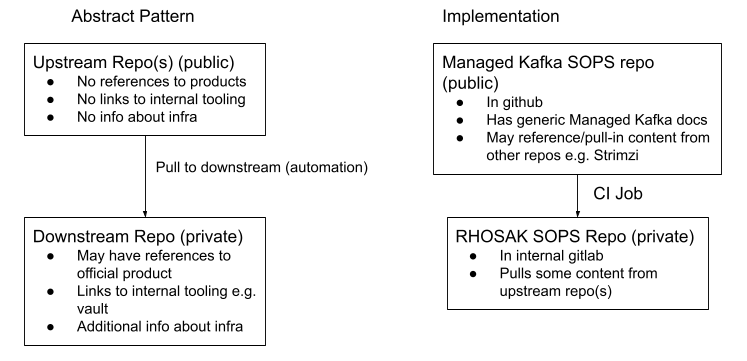
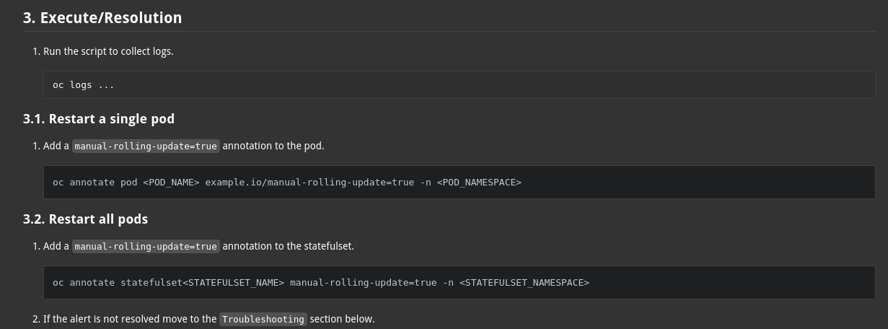

// Top style tips:
// * Use one sentence per line
// * No unexpanded acronyms
// * No undefined jargon

// No need for a title heading, it's added by the template

== Context and Problem Statement
As part of the Operate First and the company-wide open source path to cloud services, opening and defining how we work in an open source manner for our cloud services is an objective. In that journey, while the teams working on RHOSAK including its leadership define the shape of the community RHOSAK will be based on, we want to work in an open source manner for all components of RHOSAK. We want to utilise and contribute to upstream communities around RHOSAK. This means all aspects of the RHOSAK service including the ability to run and manage it, which extends to operational knowledge & procedures. One such element is Standard Operating Procedures (SOPs). These SOPs include information like how to scale up the service as load increases as well as how to diagnose and fix specific issues based on alerting. However, currently these SOPs have been written from an internal perspective and are not immediately usable or consumable upstream. This document proposes a model for maintaining upstream content that is useful in the upstream community, while also consuming and aggregating that content in a downstream friendly way.

== Goals
* Propose a model for maintaining an upstream version of SOPs, and a mechanism to consume them downstream.
* Provide a worked example of this model as a reference.

== Non-goals
* Implement a complete solution for a product or service

== Stakeholders
* Eng
* SRE

== Current Architecture
An example of what a current SOP architecture looks like is the Red Hat OpenShift Streams for Apache Kafka (RHOSAK) managed service. The RHOSAK SOPs are located in a private repository, as the SOPs contain references to Red Hat specific internal information that is not suitable for consumption by external users. Such information includes links to Vault secrets, information about how RHOSAK specifically set up their stage and production environments, further communication information e.g contact a service owner or customer and information on the infrastructure itself. The flow of how information is contributed to the RHOSAK SOPs is for an engineer or SRE to submit PRs to the repo.

== Proposal
The proposed solution is to follow a two repository model. One private repository that will contain SOPs that have the Red Hat internal information mentioned above, the other being a public repository that will have SOPs with the Red Hat internal information removed. This model will allow the SRE teams to use the private SOP repository without any information loss and allow upstream users to use and contribute to the SOP without breaching any Red Hat data policies. 



The flow of how the content of the SOPs upstream will be pulled into the downstream repo is via automation. The automation will pull from a branch in the upstream repo into a branch in the downstream repo. The content of the upstream repo will be merged into a single directory in the downstream repo to eliminate the possibility of merge conflicts as much as possible. From there the automation will create a file using a template with the new snippet of information from the upstream repo, this can then be decorated with additional information relevant to the downstream product only. The community will be in charge of the SOPs and will be responsible for maintaining the information in the upstream repositories.

To ensure Red Hat engineers contributing to an upstream repository know exactly what should and shouldn't be said, a document with terms and personas will be created to make contributing in an open source way as easy as possible. The upstream repository will also have multiple different locations reminding the user that it's a public repository.

Although not specifically called out in the diagram above, there is the potential for content to be written downstream and considered for upstream consumption. This is to be expected, especially in an existing managed service like RHOSAK where everything has been private to date. In general though, this is not the expected day to day pattern, as it would introduce an ongoing risk if content is written in the ‘private’ context. In this scenario there are a few options to choose from to address this. For example:

* Leave all existing SOPs as-is downstream and start to write new content upstream. Then when the content is approved upstream, follow the model to consume it downstream. This approach eliminates any risk associated with making existing content public.

* Extract content from existing downstream SOPs that is potentially relevant to the upstream project, taking care not to expose any potential sensitive information. Then pull it back into the downstream, decorating it as required for downstream consumption. This would be a once off ‘bulk’ extraction that exposes some risk of exposing sensitive content. Though, as it is limited to a single event, it could be given extra scrutiny than would be required if it was a regular occurrence e.g. all content written downstream first.


== Example implementation 
An example implementation of this model can be seen by the RHOSAK team through a ‘steel thread’ they are currently working on. The RHOSAK team are implementing an internal downstream version of the SOPs repo in Gitlab, as Gitlab comes with the asciidoc `includes` functionality that github does not provide. They then use this `includes` functionality to inject common or useful information pulled down from the public upstream SOPs repo into their private downstream SOPs. RHOSAK plan on using a CI Job that will automatically after a PR has been merged pull from the upstream main branch into the downstream main branch. The upstream content will be pulled into a single “includes-config” directory. From there, the automation will then create a new SOP file using their already existing SOP template containing the new code snippet from upstream. They then add extra information alongside the upstream information which would be specific to the downstream repo only. The use of  `includes` functionality will allow the engineers writing the SOPs to use this useful information in multiple SOPs without the need for manual repetition.

== Example of public SOP asciidoc :  
----
== How to roll out pods safely
=== Restart a single pod
. Add a `manual-rolling-update=true` annotation to the pod.
+

```
oc annotate pod <POD_NAME> example.io/manual-rolling-update=true -n <POD_NAMESPACE>
```
=== Restart all pods
. Add a `manual-rolling-update=true` annotation to the statefulset.
+

```
oc annotate statefulset<STATEFULSET_NAME> manual-rolling-update=true -n <STATEFULSET_NAMESPACE>
```
----

== Example of the private SOP asciidoc
----
== Execute/Resolution

1. Run the script to collect logs.
+
```
oc logs ...
```

include ::../Includes/example_downstream_includes.asciidoc[tag=restart_pod]

+
. If the alert is not resolved, move to the `Troubleshooting` section below.
---- 

== Example of private SOP `includes` asciidoc :  
----
// tag::restart_pod[]


=== Restart a single pod
. Add a `manual-rolling-update=true` annotation to the pod.
+

```
oc annotate pod <POD_NAME> example.io/manual-rolling-update=true -n <POD_NAMESPACE>
```
=== Restart all pods
. Add a `manual-rolling-update=true` annotation to the statefulset.
+

```
oc annotate statefulset<STATEFULSET_NAME> manual-rolling-update=true -n <STATEFULSET_NAMESPACE>
```
// end::restart_pod[]
----


== Example public SOP (rendered)

image::upstream.png[Upstream]


== Example private SOP (rendered)



== Threat model
* Does open-sourcing our SOPs give an attacker information that could be helpful to them in compromising our service?

** This risk is mitigated in a few ways:

*** New content is written upstream first, then pulled downstream. This forces the author to have a more open mindset and think about solving the problem in the upstream project in a more generic way rather than solving it too specifically for the downstream project.
Having upstream content be written in a way that corresponds to a default installation of the upstream community components. Any infrastructure outside of those components is omitted from the upstream content (and only added in the downstream version of a SOP, if needed)

*** Having an option to keep any existing downstream content private & introduce new upstream content as it’s created.
This model also allows any new private content to be kept in the downstream repo only.

* How to avoid a user accidentally contributing sensitive content in the upstream repo?
** Suggested ways of mitigating the concern:
*** Create a doc downstream, specifically stating what content is allowed in upstream repos and what content is not permitted. This can include topics, terms and personas.
*** Make it very clear in the upstream repo that this is a public repo. This can be said in README docs, PRs etc
*** A team could create a template for their SOPS which would contain common formatting, style and information necessary for all of their SOPs. The template would not have sensitive data as sensitive data would be stored in a location (e.g Config, Database etc in a private domain. The data would then get pulled in and rendered downstream.


== Alternatives Considered / Rejected
* ADR 84: Upstream SOPs (RHOSAK)

== Challenges

* Changing existing workflows so that content is written upstream first.
* Keeping the downstream content up to date with the latest upstream content.

== Dependencies
n/a

== Consequences if not completed
* No open source solution for SOPs in various service communities
