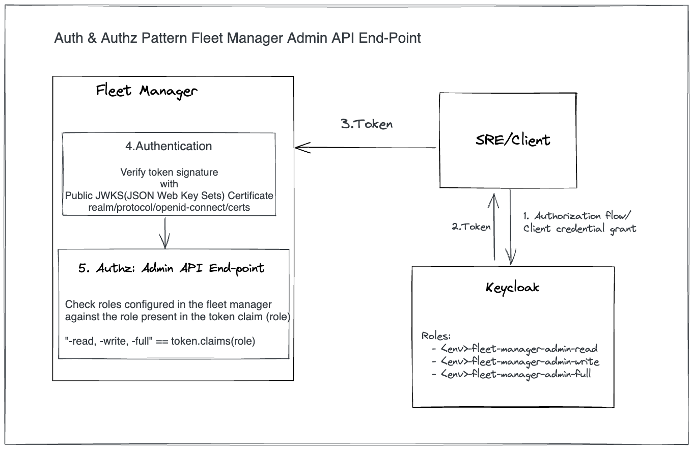
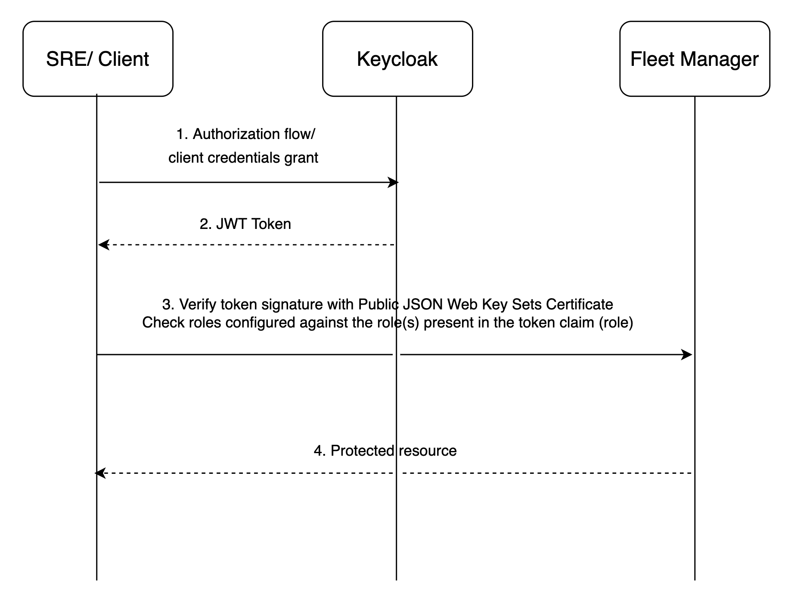

## Context and Problem Statement
The purpose of this ADR is to define a standardized approach for securing admin API in a fleet manager

## Goals
* Provide standardized way to secure admin API endpoints for fleet managers

## Non-goals

## Current situation

## Proposal

A Keycloak realm is used to authorize access to admin API endpoint(s). 
Such realm contains roles that allow access to endpoints to the privileged API users.
Recommended approach is to create a set of realm roles per environment and name them in the way that indicates the permissions they grant as follows:

* <unique-fleet-manager-prefix>-admin-read-stage
* <unique-fleet-manager-prefix>-admin-write-stage
* <unique-fleet-manager-prefix>-admin-full-stage

* <unique-fleet-manager-prefix>-admin-read-prod
* <unique-fleet-manager-prefix>-admin-write-prod
* <unique-fleet-manager-prefix>-admin-full-prod

Example roles for kas-fleet-manager in production environment along with their permissions:

[cols="1,1"]
|===
|Role name|Allowed permissions

|kas-fleet-manager-admin-read-prod
|list permissions (HTTP GET)

|kas-fleet-manager-admin-write-prod
|list and update permissions (HTTP GET and PUT)

|kas-fleet-manager-admin-full-prod
|full permissions (HTTP GET, PUT and DELETE)
|===

1. Once Keycloak instance is set up, a privileged user uses their credentials to get a JWT token from Keycloak.
2. The JWT token is sent to a admin API in a HTTP request.
3. Admin API authorization middleware verifies token signature with Public JWKS Certificate and roles included in the JWT token are checked against roles specified in the fleet manager.
4. Matching role for given admin endpoint grants access to the action associated with that endpoint.
Failure to match the required role results in returning 404 error for given admin endpoint.

## Alternatives Considered / Rejected

## Challenges
1. It needs to be ensured that the permissions are only assigned to the people that should be authorized to access protected resource(s). Standard security practices must applied to both the management of the permissions as well as the management of the access to the Keycloak instance that provides the authorization for the admin API endpoints.
2. A policy/ SOP for revoking access to the admin API roles is required.
3. Potential issues with token size can occur, if certain users are assigned many roles. This can result in increased response time for admin API endpoints and/ or requests being blocked at the gateway.

## Dependencies

## Consequences if not completed
Multiple different solutions might be implemented for securing admin API endpoints across fleet managers
