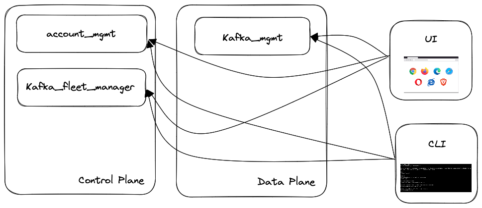

## Context and Problem Statement

The integration of the Enterprise/Hybrid option of RHOSAK in UI, SDKs and CLI has shown that there is a margin for improvement in how we expose and consume our services APIs.

* the services are exposing APIs for the offered specific functionality, but we lack an integration layer
* the data aggregation logic is duplicated, scattered, and eventually diverging in various codebases (especially UI and CLI)
* there is no "single source of truth" for data aggregated from various services
* the current REST API layer exposes the user to the entire complexity of the underlying architecture

We want to deduplicate the development effort and provide a more cohesive UX to the users.

## Goals

* a more cohesive UX experience across UI and CLI
* flow simplification for the REST API exposing opinionated endpoints directly mapping UI/CLI needs
* a single place with shared logic for aggregating and serving data
* reduce the interactions over the network for providing a given functionality
* easy testing/mocking setup for UI/CLI

## Non-goals

* provide a generic API layer for consuming the current services APIs
* provide a generic queryable layer for the current services APIs

## Current situation

In the current architecture both UI and CLI are reaching out both Control Plane and Data Plane REST API endpoints.

## Proposal

[NOTE]
*Assumption* as a first iteration we are assuming that the CLI needs can be covered by a strict subset of the functionalities needed for the UI.

We propose to integrate *one* server side component commonly known as https://samnewman.io/patterns/architectural/bff/[BFF] (Backend For Frontend).

image::with_BFF.png[Proposed Architecture]

The service is implemented using Java and Quarkus to achieve maximum collaboration across the current teams and align with Red Hat tech strategy.
The API layer is designed using API Designer(RHOAD) and conforming to the OpenAPI 3+ specification to achieve maximum collaboration across different teams and members with various technological background.
The development is driven by a "Contract First" approach leveraging the [Apicurio Codegen Quarkus Extension](https://github.com/Apicurio/apicurio-codegen/tree/main/quarkus-extension) and re-using the Java SDKs(based on Kiota) provided by the DevExp Team.
The BFF have to to be stateless so that it can easily be scaled up and down according to the needs.
All of the exposed endpoints are going to perform 1+ REST APIs calls to the underlying services and provide back the result.

### Threat model

Being it a publicly accessible service the generic service Threat model applies, we should ensure stability of the platform by having all the good practices in place:

* Rate Limiting
* Circuit Breaking
* Caching

Regarding multitenancy, it can be achieved, in the first prototype by re-using the Access Token for the initial API request to issue the following requests to the backend services.

## Alternatives Considered / Rejected

### GraphQL

Is a well known technical platform for implementing BFFs.

* Lack of expertise
* We don't want a generic API
* Challenges in caching
* Poor support for "commands"(as opposed to queries)

### Expand the current services APIs

We want the current microservices to stay vertical and opinionated toward a minimal and curated API that directly maps the functionality of the service without having to deal with the integration challenges.

## Challenges

* Caching while guaranteeing multitenancy
* Shared ownership of the component across different teams
* Avoid API proliferation after the first BFF is in place
* Potential lack of control over APIs being aggregated
* The introduction of private data planes can introduce additional issues because of backend APIs reachability

## Dependencies

* The new Java Kiota SDKs should be officially published

## Consequences if not completed

* Duplicated effort from UI and DevExp teams in re-implementing aggregation logics
* A scattered UX experience
* Slow response times(due to the number of requests in background) using the CLI and the UI
