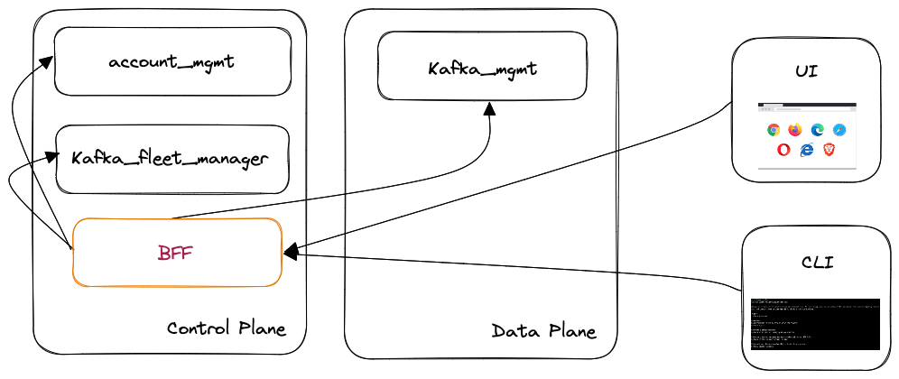

## Intent

Define an architectural component to better decouple backend services and frontend needs offering a more cohesive UX across devices and tools (such as UI and CLI).

## Motivation

UI and CLI needs to poll information from multiple separate sources causing:

* poor UX, there is need for multiple network calls to offer simple functionalities
* code duplication, data aggregation logic is scattered and duplicated across different users
* testing and mocking, decoupling frontend and backend systems with only one component

## Applicability

This pattern applies when the functionality offered by frontend/CLI/etc. needs to access various APIs and do data-aggregation logic in various forms.
In those cases placing a frontend opinionated component in front can be an appropriate solution to speed up development and be a single source of truth for integration logic.

## Description

Implementing a https://samnewman.io/patterns/architectural/bff/[BFF] for the backend services to better decouple and centralize the integration logic.

## Participants

For this pattern to apply you should have more than one "frontend" application:

* UI
* CLI
* SDKs
* mobile apps

and multiple backend services offering together a piece of functionality.

## Trade-offs

A single component in front of the backend, exclusively designed for frontend usage has a number of advantages:

* better decoupling
* looser frontend/backend dependency
* a single point for shared/integration logic
* caching

At the cost of:

* an additional backend component
* risk of APIs proliferation
